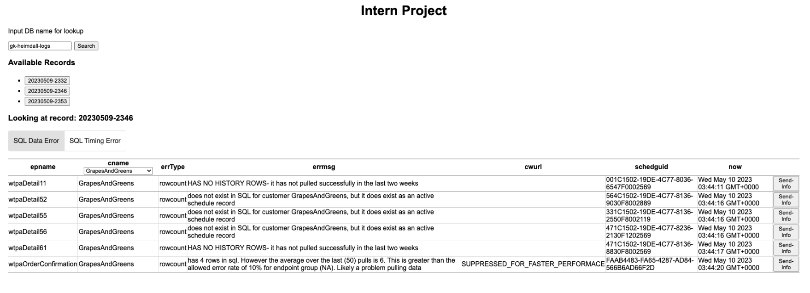

# README #

This project aims to make the log more readable and easier to parse. The app makes two API calls and then displays the data on the screen. The user can select a subset of the logs, type of error (data vs timing), and group by customer name. Each row has a button binding that can "export" data.

### Structure,Install,Run ###
The application is seperated into two folders, angular-app and server. In the server file, you need to create an .env file and add your AWS credentials.

For the Express server...

```
npm install
npm run serve
```
Note: Express is running in port 8080

For the Angular app...
```
npm install
npm start
```
Note: Angualr is running on port 4200

__Note: Both folders must be running at the same time for the application to work.__

### Example of the App ###


